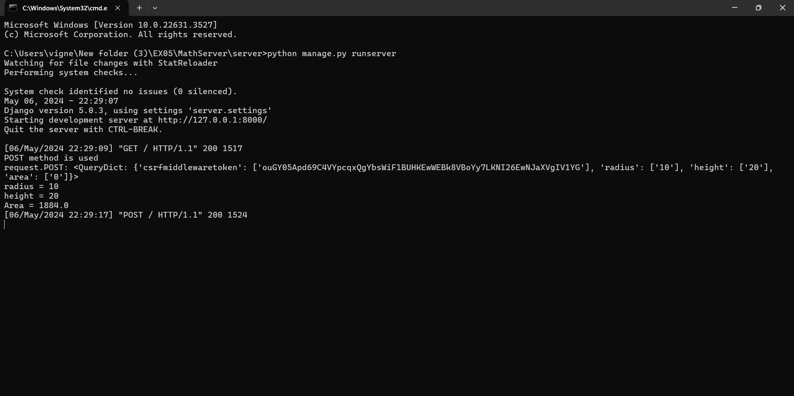
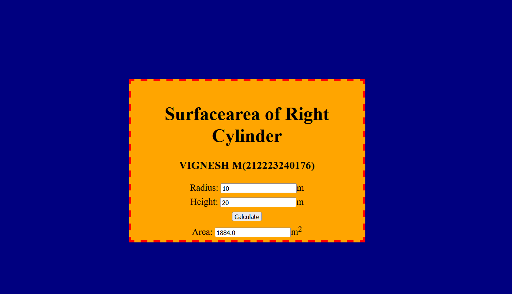

# Ex.05 Design a Website for Server Side Processing
## Date:

## AIM:
To design a website to find surface area of a Right Cylinder in server side.

## FORMULA:
Surface Area = 2Πrh + 2Πr<sup>2</sup>
<br>r --> Radius of Right Cylinder
<br>h --> Height of Right Cylinder

## DESIGN STEPS:

### Step 1:
Clone the repository from GitHub.

### Step 2:
Create Django Admin project.

### Step 3:
Create a New App under the Django Admin project.

### Step 4:
Create python programs for views and urls to perform server side processing.

### Step 5:
Create a HTML file to implement form based input and output.

### Step 6:
Publish the website in the given URL.

## PROGRAM :
```
<!DOCTYPE html>
<html>
<head>
<meta charset='utf-8'>
<meta http-equiv='X-UA-Compatible' content='IE=edge'>
<title>Area of Surface</title>
<meta name='viewport' content='width=device-width, initial-scale=1'>
<style type="text/css">
body {
    background-color: navy;
}
.edge {
    width: 100%;
    padding-top: 250px;
    text-align: center;
}
.box {
    display: inline-block;
    border: thick dashed red;
    width: 500px;
    min-height: 300px;
    font-size: 20px;
    background-color: orange;
}
.formelt {
    color: black;
    text-align: center;
    margin-top: 7px;
    margin-bottom: 6px;
}
h1 {
    color: black;
    padding-top: 20px;
}
</style>
</head>
<body>
<div class="edge">
    <div class="box">
        <h1>Surfacearea of Right Cylinder</h1>
        <h3>VIGNESH M(212223240176)</h3>
        <form method="POST">
            
            <div class="formelt">
                Radius: <input type="text" name="radius" value="{{r}}">m<br/>
            </div>
            <div class="formelt">
                Height: <input type="text" name="height" value="{{h}}">m<br/>
            </div>
            <div class="formelt">
                <input type="submit" value="Calculate"><br/>
            </div>
            <div class="formelt">
                Area: <input type="text" name="area" value="{{area}}">m<sup>2</sup><br/>
            </div>
        </form>
    </div>
</div>
</body>
</html>
```

## SERVER SIDE PROCESSING:


## HOMEPAGE:



## RESULT:
The program for performing server side processing is completed successfully.
